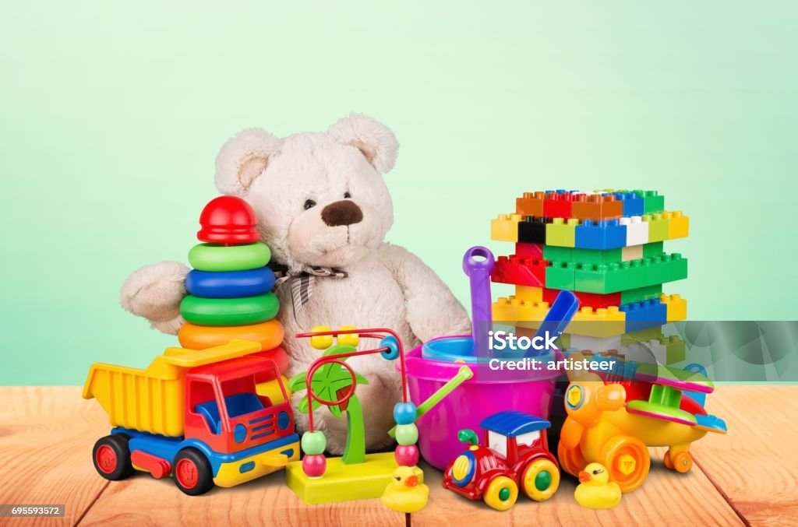

# Minijuegos - Mini Games

Este repositorio contiene una colección de minijuegos creados para mejorar y probar mis habilidades como programador. Los minijuegos estarán desarrollados en diferentes lenguajes de programación y utilizando varios gestores de bases de datos. El foco principal de este proyecto es la lógica de programación, permitiéndome aprender y explorar nuevas técnicas y tecnologías. A medida que avancen, estos minijuegos crecerán hasta formar aplicaciones más complejas.

---

This repository contains a collection of mini-games created to improve and test my programming skills. The mini-games will be developed using different programming languages and database management systems. The main focus of this project is on programming logic, allowing me to learn and explore new techniques and technologies. As progress is made, these mini-games will evolve into more complex applications.
