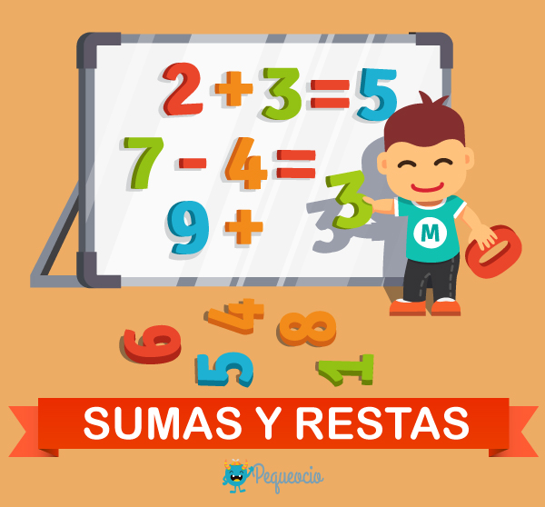

# Proyecto: Suma y Resta

## Versión: 0.0.1



### Descripción

**Suma y Resta** es un minijuego diseñado para retar a los usuarios con operaciones matemáticas de suma y resta. Este proyecto está enfocado en mejorar las habilidades de programación relacionadas con el manejo de inputs, generación de números aleatorios y operaciones matemáticas básicas, además de permitir la práctica de estructuras de control de flujo.

### Características del Juego

1. **Operaciones Mixtas**: El usuario puede practicar sumas y restas consecutivas.
2. **Rango Numérico**: El usuario define el rango numérico en el que se generarán los números aleatorios para las operaciones.
3. **Número de Operaciones**: El usuario determina cuántas operaciones se realizarán en una sesión.
4. **Ingreso del Resultado**: El usuario deberá ingresar la respuesta para cada operación.
5. **Verificación del Resultado**: El programa calculará y mostrará la respuesta correcta.
6. **Porcentaje de Aciertos**: Al final, se mostrará el porcentaje de aciertos del jugador basado en las respuestas ingresadas.

### Requisitos del Sistema

- **Lenguaje de Programación**: Python 3.x
- **Librerías Necesarias**: No se requieren librerías externas.

### Instalación

1. Clona este repositorio en tu máquina local:
   ```bash
   git clone https://github.com/Daniel-L10N/Juegos.git
